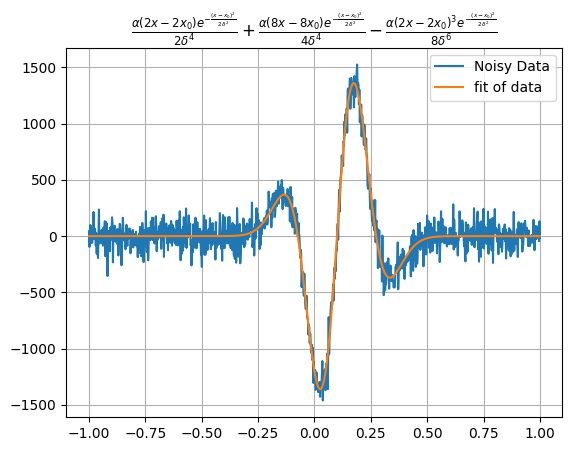
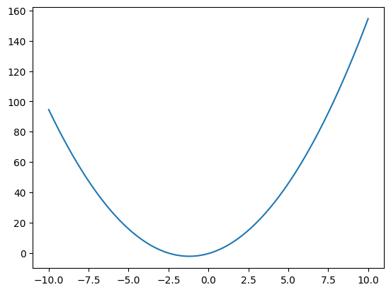
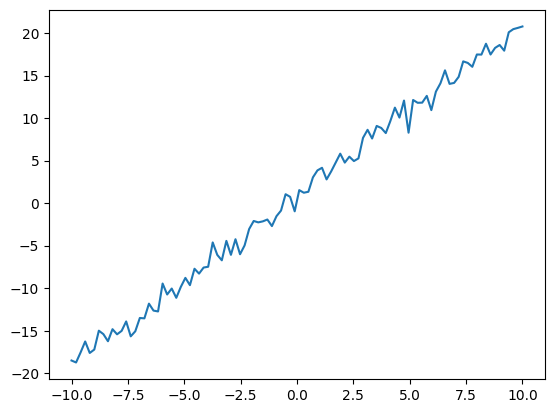
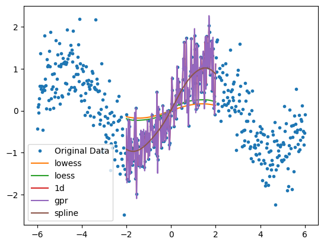
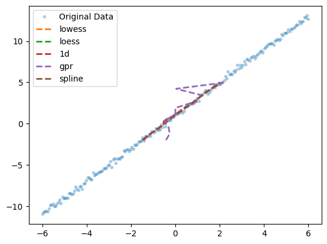

# univariate_tools
Tools to fit, interpolate, and synthesize univariate data.


# Installation 
## Method 1 - Directly from Github
```shell
pip install git+https://github.com/sandersa-nist/univariate_tools.git
```
## Method 2 - Clone then Install
1. Use your favorite way to clone the repo or download the zip file and extract it.  
2. pip install to that location (note pip expects a unix style string 'C:/univariate_tools/')

```shell
pip install <path to top folder>
```
# Use case
Have you ever wanted to fit a really weird function of one variable? How about make a complicated synthetic time-domain signal? Have calibration data on an irregular grid and you need to interpolate? Then univariate_tools is for you!
FunctionalModel is a blend of [sympy](https://www.sympy.org/en/index.html) and [numpy](https://numpy.org/doc/stable/) functionality that lets the user do all kinds of math with functions and then fit data. 
```python
from univariate_tools import *
# lets make a composite function
line=FunctionalModel(parameters=["m","b"],variables="x",equation="m*x+b")
gaussian=FunctionalModel(parameters="alpha x0 delta",variables="x",equation="alpha*exp(-1*(x-x0)^2/(2*delta**2))")
gauss_line=line+gaussian
x_data=np.linspace(-1,1,1000)
plt.plot(x_data,gauss_line(alpha=1,x0=.1,delta=.1,m=1.2,b=.1,x=x_data))
plt.title("${0}$".format(gauss_line.to_latex()))

```


# Workflow
## Calculating Data 
1. To calculate a function, first create a FunctionalModel. There should be a set of parameters, one variable, and an equation. 
```python
model = FunctionalModel(parameters=["a","b","c"],variables="x",equation="a*x**2+b*x+c")
```
2. Set the parameters
```python
model.set_parameters({"a":1.25,"b":3,"c":-.4})
```
3. Calculate the result with an input of x
```python 
x_data = np.linspace(-10,10,1000)
y_data = model(x_data)
plt.plot(x_data,y_data)
```


## Fitting Data
1. To fit data, start with defining a FunctionalModel.There should be a set of parameters, one variable, and an equation. 
```python
model = FunctionalModel(parameters=["m","b"],variables="x",equation="m*x+b")
```
2. Use model.fit_data, for more complex fits provide an initial guess 
```python
x_data = np.linspace(-10,10,1000)
y_data = 2.12*x_data+3.11
model.fit_data(x_data = x_data,y_data = y_data,initial_guess = {"m":2,"b":3})
```
3. The fit parameters are now in the parameter_values
```python
model.parameter_values
```
```python
{'m': 2.12, 'b': 3.11}
```
## Simulate Data
1. Specify the parameters, variable, equation, noise characteristics, x_data
```python
simulated_data = DataSimulator(**{"parameters":["m","b"],
                   "variables":"x",
                   "equation":"m*x+b",
                   "parameter_values":{"m":2,"b":1},
                   "output_noise_type":"normal",
                   "output_noise_width":1,
                   "output_noise_center":0,
                   "output_noise_amplitude":1.,
                   "random_seed":42,
                   "x":np.linspace(-10,10,100)})
```
2. Now the simulated data is in the data attribute and the x_data is in the x attribute
```python
plt.plot(simulated_data.x,simulated_data.data)
```


## Interpolate Data
This is a resampling of a data stream to a new x set of points, the methods are lowess, loess, 1d, gpr and spline. Each one of these methods has a different set of options that can be passed with keywords
```python
"""
    *********************************************************************************************
    refs: https://docs.scipy.org/doc/scipy/reference/generated/scipy.interpolate.interp1d.html, options for kind are
    ‘linear’, ‘nearest’, ‘nearest-up’, ‘zero’, ‘slinear’, 
    ‘quadratic’, ‘cubic’, ‘previous’, or ‘next’. ‘zero’, ‘slinear’, ‘quadratic’ and ‘cubic’
    ****************************************************************************************
    https://www.statsmodels.org/dev/generated/statsmodels.nonparametric.smoothers_lowess.lowess.html
    ***********************************************************************************************
    https://scikit-learn.org/stable/modules/gaussian_process.html
    ***************************************************************
    https://docs.scipy.org/doc/scipy/tutorial/interpolate/smoothing_splines.html
    ********************************************************************************"""
```

1. provide the data as an x_data and y_data array (need to be the same size) and decide the new_x_data. There are parametric and non-parametric methods
```python
    x_data = np.linspace(-6,6,500)
    signal = np.sin(x_data)+np.random.normal(scale=.5,size=len(x_data))
    plt.plot(x_data,signal,".",label="Original Data")
    for interp_type in ["lowess","loess", "1d", "gpr","spline"]:
        new_x = np.linspace(-2,2,500)
        interp_data = interpolate_data(x_data=x_data,y_data=signal,new_x_data=new_x,method=interp_type)
        plt.plot(new_x,interp_data,label=interp_type)
    plt.legend()
    plt.show()
    
```



## Reverse Regressor
This is used when you have a monotonic function that represents a calibration and you have new y points. It has similar methods and options as the interpolate data function.
```python
x_data = np.linspace(-6,6,200)
signal = 2*x_data+1+np.random.normal(scale=.2,size=len(x_data))
plt.plot(x_data,signal,".",label="Original Data",alpha=.3)

for interp_type in ["lowess","loess", "1d", "gpr","spline"]:
    try:
        new_y = np.linspace(-2,5,10)
        new_x = reverse_regressor(x_data=x_data,y_data=signal,new_y_data=new_y,method=interp_type)
        print(f"{interp_type}:{new_x},{new_y}")
        plt.plot(new_x,new_y,label=interp_type,linewidth=2,linestyle="dashed")
    except Exception as e:
        print(e)
plt.legend()
plt.show() 
```


# Example
An [example](./examples/Example.ipynb) of creating a functional model, fitting data, creating composite models and simulating data. 

# API Documentation
The [API Documentation](https://sandersa-nist.github.io/univariate_tools) links to the __init__.py file and has the primary submodules linked. 

# Contact
Aric Sanders [aric.sanders@nist.gov](mailto:aric.sanders@nist.gov)


# NIST Disclaimer
Certain commercial equipment, instruments, or materials (or suppliers, or software, ...) are identified in this repository to foster understanding. Such identification does not imply recommendation or endorsement by the National Institute of Standards and Technology, nor does it imply that the materials or equipment identified are necessarily the best available for the purpose.

